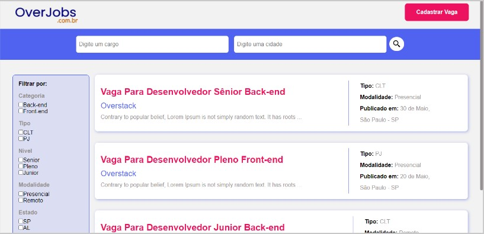

<!---->
<div align="center">

</div>

# OverJobs - Plataforma fictícia de vagas e oportunidades profissionais

<p>Esse projeto foi feito por: <strong>Thiago Silva Lopes</strong>, em 08/2021,</br>
tendo como base, as aulas de Next.js, na <a href="https://www.digitalmakerweek.com.br/">Digital Maker Week #02</a> da <a href="https://app.overstack.com.br/">OverStack</a>

## Demo:

### ⚠ Esse projeto possui um API separada do aplicativo❗❗❗ Sendo assim, caso queira rodar esse app localmente, clone a API no repositório:

Demo: https://api-overjobs-thiagosilvalopes.herokuapp.com/jobs </br>

##### Para instalar o projeto localmente, com a pasta "node_modules":

```
npm install
```

##### Para compilar/executar o projeto localmente:

```
npm run dev
```

<small>© Thiago Silva Lopes </small>
